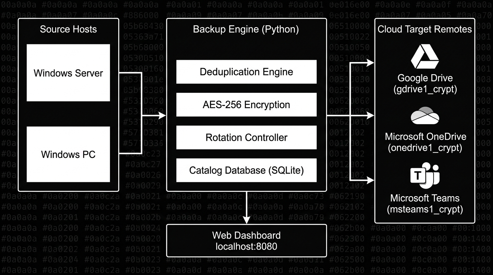

# CloudBackup for Windows 🛡️


CloudBackup for Windows is a zero-knowledge encrypted backup solution designed specifically for Windows hosts, providing fully automated file protection across multiple cloud storage providers. It allows you to seamlessly back up files from PCs and servers, deduplicate data to save space, and automatically rotate uploads across multiple cloud drives when storage fills up, all managed through an intuitive local web dashboard.

---

## 📸 Dashboard Preview


*The main CloudBackup for Windows dashboard, showing active drives, sources, and recent backup runs.*


*Easily connect new cloud storage providers like Google Drive, OneDrive, or SharePoint through the automated wizard.*

---

## 🚀 What It Does

CloudBackup for Windows simplifies the complex process of securing your data. It runs seamlessly on Windows and handles everything from file selection to encrypted cloud upload.

- **Automated Backup:** Runs silently in the background as a Windows Scheduled Task. No need to remember to run your backups manually.
- **Zero-Knowledge Encryption:** Encrypts everything locally with AES-256 before uploading to the cloud. Your cloud provider cannot read your files.
- **Multi-Host Support:** Consolidate and manage backups from multiple Windows PCs and servers in one place.
- **Storage Rotation:** Automatically switches to the next available cloud drive when one becomes full, allowing you to pool free storage accounts.
- **Deduplication:** Analyzes files and only uploads new or modified data to minimize storage usage and bandwidth.
- **Web Dashboard:** Provides a local web interface on port 8080 to configure sources, monitor progress, and manage storage targets.
- **SQLite Catalog:** Maintains a fast, local SQLite database to track snapshots and file versions for quick restores.
- **Seamless Restoration:** Supports re-authorization and restoration from any previously connected drive, even on a new Windows installation.

---

## 🎯 Who Is It For

- **Home Users:** Needing a reliable, set-and-forget Windows backup for family photos, videos, and important documents without expensive subscriptions.
- **Freelancers & Small Businesses:** Looking to protect client files across multiple cloud storage accounts without paying for enterprise software licenses.
- **Power Users & Homelabbers:** Wanting encrypted backup with multi-drive rotation for their Windows server environments or NAS setups running Windows.
- **Privacy Advocates:** Requiring open source backup tools with robust zero-knowledge encryption to ensure data sovereignty.

---

## 💡 Why It Exists

Many existing backup solutions are either too expensive, locked into a single cloud provider, or lack native, easy-to-use Windows support. Proprietary solutions often lack transparency regarding how encryption is handled, leaving privacy-conscious users in the dark. 

CloudBackup for Windows was created to fill this gap by providing an open-source, automated backup tool that prioritizes your privacy through strong encryption while maximizing your existing cloud storage across providers like Google Drive and Microsoft OneDrive. It gives you enterprise-grade features like deduplication and storage rotation without the recurring enterprise price tag. By leveraging Windows native scheduled tasks, it ensures rock-solid reliability without resource-heavy background services.

---

## 🔑 Key Features

| Feature | Description |
|---------|-------------|
| **AES-256 Encryption** | Your data is encrypted before it leaves your machine. Only you hold the keys. |
| **Deduplication** | Saves storage space and bandwidth by only backing up unique chunks of data. |
| **Multi-Drive Rotation** | Automatically overflows to backup drive B when backup drive A is full. |
| **Web Dashboard** | Easy-to-use local web UI (port 8080) for managing schedules and restores. |
| **Windows Native** | Integrates directly with Windows Scheduled Tasks for reliable automation. |
| **SQLite Catalog** | Fast and efficient local indexing of all your backup snapshots and files. |
| **Multi-Host** | Support for backing up multiple machines (e.g., `your-pc`, `your-server`) to the same cloud pool. |
| **Granular Restores** | Restore a single file, a directory, or an entire host snapshot from any point in time. |
| **Bandwidth Limiting** | Prevent backups from saturating your internet connection during working hours. |

---

## ☁️ Cloud Provider Support

CloudBackup for Windows supports major cloud providers out of the box, with more on the way.

| Provider | Status | Notes |
|----------|--------|-------|
| Google Drive | ✅ Supported | Requires standard OAuth flow. |
| Microsoft OneDrive | ✅ Supported | Personal and Business accounts. |
| Microsoft Teams SharePoint | ✅ Supported | Direct document library access. |
| Amazon S3 | 🚧 Planned | Waiting on API integration. |
| Backblaze B2 | 🚧 Planned | High priority for next release. |
| Local File System | ✅ Supported | Useful for testing or local NAS targets. |

> [!NOTE]  
> CloudBackup for Windows utilizes `rclone` under the hood to facilitate reliable connections to these cloud providers. You do not need to configure rclone manually; the dashboard handles it for you.

---

## ⚡ Quick Start

Get your Windows backup running in five simple steps:

1. **Install Dependencies:** Ensure Python 3.10+ and `rclone` are installed on your Windows machine.
2. **Clone the Repository:** Download the CloudBackup for Windows source code to your machine.
3. **Run the Setup:** Execute `setup.bat` to install Python requirements and initialize the SQLite catalog.
4. **Start the Dashboard:** Run `start_dashboard.bat` and open `http://localhost:8080` in your browser.
5. **Add a Drive & Backup:** Use the dashboard to authorize a cloud drive (e.g., Google Drive) and create your first backup schedule!

---

## 🛠️ Requirements

Before installing, ensure your system meets the following criteria:

- **Operating System:** Windows 10, Windows 11, or Windows Server 2016+ (64-bit recommended)
- **Language:** Python 3.10 or higher (Ensure Python is added to your PATH)
- **Backend:** `rclone` (must be installed and available in your System PATH)
- **Storage:** At least one active cloud storage account (e.g., `youraccount@example.com` on Google Drive or OneDrive)
- **Hardware:** Minimal. At least 4GB RAM recommended for deduplication of large datasets.

> [!IMPORTANT]  
> Please ensure that your Windows user account has the necessary permissions to create Windows Scheduled Tasks if you intend to use the automated backup feature. Admin rights may be required during the initial setup of tasks.

---

## 📦 Installation

Installing CloudBackup for Windows involves setting up the Python environment, configuring the database, and registering the necessary background tasks. We have a dedicated installation guide that walks you through every step.

👉 **[Read the full Installation Guide (INSTALL.md)](docs/INSTALL.md)**

### Brief Overview of Installation Steps

For advanced users, the basic installation flow is:
```bat
git clone https://github.com/example/cloudbackup-windows.git
cd cloudbackup-windows
python -m venv venv
call venv\Scripts\activate.bat
pip install -r requirements.txt
python initialize_db.py
```
After these steps, you can launch the dashboard.

---

## 📖 Usage

Once installed, CloudBackup for Windows is designed to be largely automated, but you can always manage it via the local web dashboard. The dashboard provides a unified view of all your backups, cloud drives, and system health.

- **[Walkthrough (WALKTHROUGH.md)](docs/WALKTHROUGH.md):** A comprehensive guide to configuring sources, managing drives, and restoring files.
- **[Quickstart (QUICKSTART.md)](docs/QUICKSTART.md):** Get up and running in 5 minutes with a basic Google Drive backup.

### Navigating the Dashboard

When you open `http://localhost:8080`, you will see:
1. **Overview:** Recent activity, storage usage, and active hosts (`your-pc`, `your-server`).
2. **Sources:** Manage which folders are backed up.
3. **Targets:** Add or rotate cloud storage accounts.
4. **History:** View logs of past automated backup runs.
5. **Restore:** Search and recover your files.

> [!TIP]  
> Bookmark `http://localhost:8080` in your web browser for quick access to the dashboard. You can also pin it as an "App" using Chrome or Edge.

---

## 🏗️ Architecture

CloudBackup for Windows operates on a decoupled architecture, designed for resilience and security on Windows systems.

The Python backend is the brain of the operation. It handles the cryptographic heavy lifting (encryption), analyzes files for deduplication, and coordinates scheduling via Windows Task Scheduler. It maintains a local SQLite catalog to track file state, metadata, and snapshots. 

When a scheduled backup job triggers, the backend securely processes the files from your Windows host. It splits large files into manageable chunks, encrypts them, and utilizes the robust `rclone` engine to transmit the encrypted data to the configured cloud storage targets. If a target reports it is full, the system automatically rotates to the next available drive in your pool.

The local web dashboard (built with lightweight web technologies) communicates with this backend via a secure local REST API, allowing you to manage the system without interfering with background operations.


*CloudBackup for Windows high-level architecture, showing the data flow from local storage, through the encryption engine, and up to multi-cloud targets.*

👉 **[Read the Architecture Documentation (ARCHITECTURE.md)](docs/ARCHITECTURE.md)**

---

## ⚙️ Advanced Configuration (Optional)

For power users, CloudBackup for Windows allows for extensive customization through its JSON configuration files. Here is an example of what an advanced job configuration looks like:

```json
{
  "job_id": "daily_documents_backup",
  "host": "your-pc",
  "sources": [
    "C:\\Users\\default\\Documents",
    "D:\\WorkFiles"
  ],
  "exclude_patterns": [
    "*.tmp",
    "~*",
    "node_modules/"
  ],
  "encryption": {
    "algorithm": "AES-256-GCM",
    "key_derivation": "Argon2id"
  },
  "targets": [
    {
      "provider": "google_drive",
      "account": "youraccount@example.com",
      "priority": 1
    },
    {
      "provider": "onedrive",
      "account": "youraccount@example.com",
      "priority": 2
    }
  ],
  "deduplication": {
    "enabled": true,
    "chunk_size_mb": 5
  },
  "schedule": {
    "type": "daily",
    "time": "02:00"
  },
  "bandwidth_limit": "5M"
}
```

This configuration demonstrates how you can easily define multiple sources, exclude specific file types, setup target rotation priorities, and enforce bandwidth limits.

---

## 🔧 Troubleshooting

Encountering issues with a backup job, cloud authorization, or the dashboard? Check our troubleshooting guide for common solutions.

👉 **[Read Troubleshooting Guide (TROUBLESHOOTING.md)](docs/TROUBLESHOOTING.md)**

### Common Issues

- **Dashboard won't load:** Ensure that port 8080 is not being used by another application.
- **Authentication fails for cloud drive:** Sometimes OAuth tokens expire. Try re-authorizing the drive from the Targets menu.
- **Scheduled task not running:** Check the Windows Task Scheduler history tab for the specific task to see if it was denied permission to run in the background.

---

## ❓ FAQ

Have questions about how deduplication works or how to restore a snapshot on a new PC?

👉 **[Read the Frequently Asked Questions (FAQ.md)](docs/FAQ.md)**

**Q: Can I restore my files if my computer dies?**
A: Yes. As long as you have your encryption password, you can install CloudBackup for Windows on a new machine, connect it to your cloud drive, and it will rebuild the SQLite catalog from the cloud data, allowing you to restore everything.

**Q: Does it support incremental backups?**
A: Because of the deduplication engine, every backup acts like an incremental backup in terms of storage used, but acts as a full backup when you want to restore it. Only new data is uploaded.

---

## 🔒 Security

Security and privacy are the core principles of CloudBackup for Windows. All your files are encrypted client-side using AES-256 before being transmitted, meaning the cloud providers have zero knowledge of your data.

👉 **[Read the Security Policy (SECURITY.md)](docs/SECURITY.md)**

> [!CAUTION]  
> **Do not lose your encryption key/password!** Because this is a zero-knowledge encrypted backup, if you lose your encryption password, your data cannot be recovered by anyone, under any circumstances. There is no backdoor.

### Encryption Details
- **Cipher:** AES-256 in GCM mode.
- **Key Derivation:** Argon2id is used to derive the cryptographic key from your master password.
- **Metadata:** File names and directory structures are also encrypted before upload.

---

## 🤝 Contributing

We welcome contributions to make this open source backup tool even better! Whether it's adding support for new cloud providers, fixing bugs, or improving documentation, your help is appreciated.

👉 **[Read Contributing Guidelines (CONTRIBUTING.md)](docs/CONTRIBUTING.md)**

### How to Help
- Submit bug reports and feature requests via GitHub Issues.
- Review open Pull Requests.
- Improve our documentation.
- Share your experiences and configurations.

---

## 📄 License

This project is licensed under the MIT License - see the [LICENSE](LICENSE) file for details. You are free to use, modify, and distribute this software for personal or commercial purposes.

---

## 🙏 Acknowledgements

CloudBackup for Windows relies on the incredible work of the open-source community. Special thanks to:

- **[rclone](https://rclone.org/):** The "Swiss army knife of cloud storage" which powers the robust backend transfers for this project.
- The Python core developers and the broader open-source ecosystem.
- Our amazing community of testers and contributors.

---

*Thank you for using CloudBackup for Windows to protect your important files. If you find this project useful, please consider giving it a star on GitHub!*
