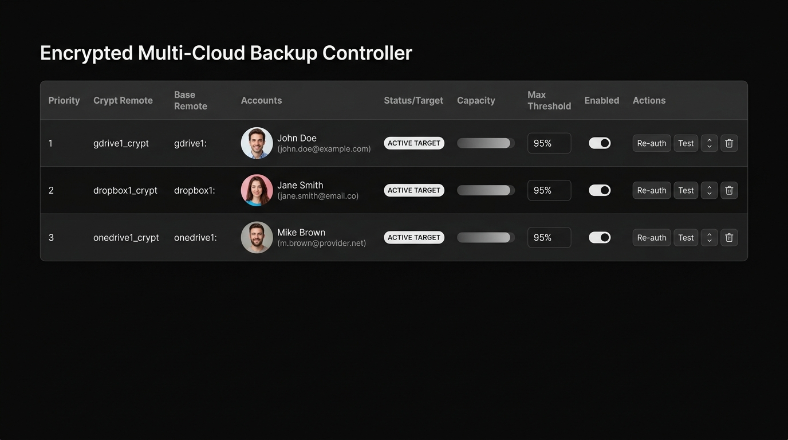
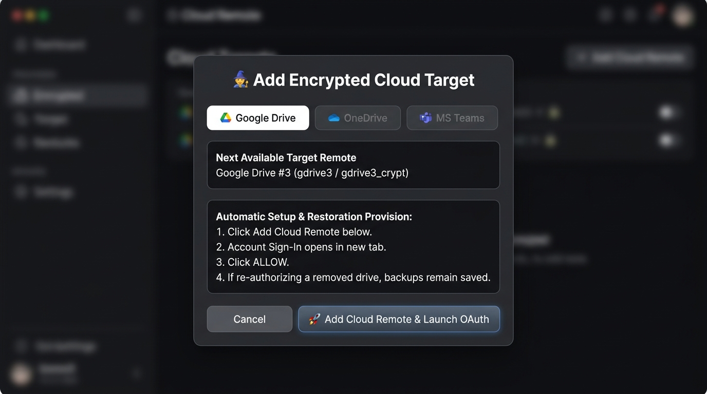

# CloudBackup for Windows - Beginner Walkthrough

## 1. Introduction
Welcome to CloudBackup for Windows! We built this tool to make backing up your computer safe and easy. 

This guide will walk you through setting up your very first backup. We will assume you already have Python and rclone installed on your computer. Don't worry if you are not a technical expert. We will take it step by step.

## 2. Part 1: Start the Web Dashboard
The easiest way to use CloudBackup is through our Web Dashboard.

1. Open your Start Menu and type `cmd` to open the Command Prompt.
2. Navigate to your CloudBackup folder.
3. Run the following command to start the server:
   ```cmd
   python start_dashboard.py
   ```
4. Open your web browser (like Chrome or Edge).
5. Go to the address: `http://localhost:8080`.

You should now see the main CloudBackup dashboard.


*The main dashboard overview.*

## 3. Part 2: Add Your First Cloud Drive Target
A "Target" is simply where your files will go. Let's add a Google Drive account.

1. On the dashboard, click the **Add Remote** button.
2. Select **Google Drive** from the dropdown list.
3. Give your drive a simple name, like `Drive1`.
4. Click **Connect Account**.


*The Add Remote wizard.*

5. A new browser window will open. Google will ask you to sign in.
6. Sign in with your Google account.
7. Click **Allow** when asked to grant rclone access.
8. Go back to the CloudBackup dashboard. It should now show your new drive as connected.

> [!NOTE]
> CloudBackup automatically creates a secure, encrypted folder on this drive. Your data is encrypted before it leaves your computer. Google cannot read your files.

## 4. Part 3: Add Additional Cloud Drives
CloudBackup can chain multiple drives together. If one drive gets full, it moves to the next one automatically.

1. Click **Add Remote** again.
2. This time, select **Microsoft OneDrive** or **Microsoft Teams**.
3. Name this drive `Drive2`.
4. Click **Connect Account**.
5. Follow the Microsoft sign-in prompts to grant access.
6. Return to the dashboard. You should now see both `Drive1` and `Drive2` in your list.

## 5. Part 4: Configure Backup Sources
Now we need to tell CloudBackup which folders to protect.

1. On the dashboard, click the **Sources** tab.
2. Click **Add Folder**.
3. A file browser will appear. Choose the folder you want to back up. A common choice is your `Documents` folder.
4. Click **Select Folder**.
5. The folder path will appear in your list (e.g., `C:\Users\YourName\Documents`).

> [!TIP]
> Start small. Try backing up just one important folder first. You can always add more later.

## 6. Part 5: Set Fill Thresholds
We need to tell the system when to switch from `Drive1` to `Drive2`. This is called a "Fill Threshold".

1. Go back to the **Remotes** tab.
2. Find `Drive1` in the list.
3. Next to it, you will see a box for **Fill Threshold**. It usually defaults to 90%.
4. You can leave it at 90%. This means when `Drive1` is 90% full, CloudBackup will automatically start sending new data to `Drive2`.
5. Click **Save Settings**.

## 7. Part 6: Run Your First Backup
You are now ready to back up your files!

1. Go to the **Overview** tab.
2. Click the big green **Run Backup Now** button.
3. A progress bar will appear. 

> [!IMPORTANT]
> The first backup might take a while, depending on how much data you have and your internet speed. Be patient.

## 8. Part 7: Verify the Backup
It is always good to check that things worked correctly.

1. Wait for the backup progress bar to reach 100%.
2. Look at the **Recent Logs** section on the dashboard.
3. You should see a message saying "Backup completed successfully."
4. You can also log into your Google Drive directly in your browser. You will see a new folder created by CloudBackup, but the files inside will look like scrambled text. That is the encryption working!

## 9. Part 8: Set Up Automatic Scheduling
You don't want to click the button every day. Let's set it to run automatically.

1. Click the **Settings** tab.
2. Find the **Schedule** section.
3. Check the box that says **Enable Daily Backup**.
4. Choose a time. Pick a time when your computer is on, but you are not actively using it, like `03:00 AM`.
5. Click **Apply Schedule**.

CloudBackup will now tell the Windows Task Scheduler to run a backup automatically every day at that time.

## 10. Part 9: Restoring Files
If you delete a file by mistake, you can get it back.

1. Go to the **Restore** tab.
2. You will see a list of the folders you backed up.
3. Click through the folders to find your missing file.
4. Check the box next to the file.
5. Click **Restore Selected**.
6. CloudBackup will download the file, decrypt it, and put it back in its original location.

## 11. Part 10: Re-authorizing a Removed Drive
Sometimes cloud providers expire access tokens. If a drive disconnects, here is how to fix it.

1. If a drive stops working, it will show a red warning on the dashboard.
2. Click the **Re-authorize** button next to the failed drive.
3. A browser window will open.
4. Sign into your cloud account again and grant access.
5. The drive status will turn green, and backups will resume.

## 12. Tips and Best Practices

> [!WARNING]
> Keep your computer turned on during your scheduled backup time. If the computer is asleep, the backup might not run.

*   **Check logs weekly:** Take a quick look at the dashboard every week to make sure backups are running without errors.
*   **Don't delete the catalog:** The local `catalog.db` file is very important. It tells the system what has been backed up. Never delete it manually.
*   **Keep your password safe:** CloudBackup encrypts your data with a master password. If you lose this password, your backups cannot be restored. Keep it somewhere safe.
